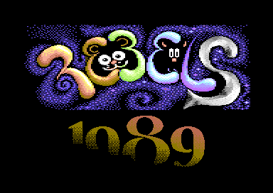

# Example of a bath file

This is bath file converted from two separate .bat files to build the Commodore 64 demo [Rebels 1989](https://csdb.dk/release/?id=182349). The first is convert.bat that converts images etc. to usable data and the second is make.bat that runs an assembler on source code to create a single .prg file for the demo.

The demo can be emulated in a browser for reference to the images: [Floooh tiny8bit emulators: Rebels 1989)](https://floooh.github.io/tiny8bit/c64.html?file=c64/rebels1989_c64.prg)

Running each command in sequence takes 4 seconds, running with parallel commands brings that down to 1.2 seconds for a full rebuild. Just checking the timestamps when no change is done brings the time down to 160 milliseconds!

Imagine the iteration possibilities of this 25x build time speedup :)



## How to read this example

First the tools are declared. Multiple tool aliases are created for the same executable to make it easier to build data from specific assets.

* x65 is an assembler, it is available [here](https://github.com/sakrac/x65).
* gfx is an older graphics conversion tool that turned into [C64Gfx](https://github.com/sakrac/C64Gfx)
* tudegfx is an even older graphics tool for the game [Space Moguls](https://protovision.itch.io/space-moguls).
* EasyPatch is a custom tool that diffs files and lets you patch from one to another, here is it used for switching from one SID music track to another.

It is quite a lot of files that goes into a demo these days...

# The bath file for Rebels 1989

```
$Tools

x65 tools\x65 $In $Out $Args -sym $Out.path\$In.filename.sym -lst=lst\$In.filename.lst -vice obj\$In.filename.vs
exomizer tools\exomizer mem -q $In -o $Out
gfx tools\gfx $In $Args -out=$Out.noext
gfx_textmc tools\gfx -textmc $In $Args -out=$Out.noext
gfx_agnus tools\gfx -agnus $In $Out
gfx_bobfont tools\gfx -bobfont $In $Out $Args
gfx_char_hires tools\tudegfx charhires $In $Out -bg=0
gfx_mcbm tools\tudegfx MCBM $In -out=$Out.noext
gfx_col tools\gfx -columns $In $Out $Args
gfx_screens tools\gfx -screens $Out.1 *$In.noext_all
gfx_charspr tools\gfx -charspr $In $Out $Args
easypatch tools\EasyPatch $In $Out $Args

$Execution

$Parallel

# Convert assets into machine usable formats

gfx_agnus bin\TTTEye0.bin : assets\TTTEye0.png
gfx_agnus bin\TTTEye1.bin : assets\TTTEye1.png
gfx_agnus bin\TTTEye2.bin : assets\TTTEye2.png
gfx_agnus bin\TTTEye3.bin : assets\TTTEye3.png

gfx_char_hires bin\FatAgnusText.bin : assets\FatAgnusText.png

gfx_bobfont bin\bobfont : assets\bobfont.png 37

gfx_mcbm (bin\boblogo.ocl bin\boblogo.ccr) : assets\boblogo.png

gfx_col bin\hiddenfont.bin : assets\hiddenfont.png 0 32 1x8
gfx_col bin\hiddenlogo.bin : assets\hiddenlogo.png 0 8x3 3x21 -pad=1
gfx_col bin\hiddenntsc.bin : assets\hiddenntsc.png 0 8x1 3x21 -pad=1

gfx_col bin\poseidon.bin : assets\poseidon.png 11 6 2x24

gfx_col bin\dkclimb.bin : assets\dkclimb.png 11 4 1x17
gfx_col bin\tintin_rocket.bin : assets\tintin_rocket.png 11 2 2x21
gfx_col bin\UFOSprites.bin : assets\UFOSprites.png 11 3 3x21 -pad=1
gfx_col bin\heli_large.bin : assets\heli_large.png 11 1 2x8
gfx_col bin\heli_small.bin : assets\heli_small.png 11 1 1x6
gfx_col bin\tintin_rocket_exhaust.bin : assets\tintin_rocket_exhaust.png 11 2 1x8
gfx_col bin\dkascend.bin : assets\dkascend.png 11 3 2x21
gfx_col bin\dkcranestyle.bin : assets\dkcranestyle.png 11 7 2x21

gfx bin\skyline : assets\skyline.png 11 0 7 6 -rawcol
gfx_textmc (bin\SubwayRebels.chr bin\SubwayRebels.col bin\SubwayRebels.scr bin\SubwayRebels.scrs) : assets\SubwayRebels.png 12 15 10 -rawcol
gfx_textmc (bin\Bridge.chr bin\Bridge.col bin\Bridge.scr bin\Bridge.scrs) : assets\Bridge.png 0 8 9 -rawcol
gfx_textmc (bin\MD1Train.chr bin\MD1Train.col bin\MD1Train.scr bin\MD1Train.scrs) : assets\MD1Train.png 0 11 12 -rawcol

gfx_charspr bin\AltaVincenzo : assets\AltaVincenzo.png 0 1
gfx_col bin\1989.bin : assets\1989.png 0 8x4 3x21 -pad=1

gfx_mcbm (bin\rebels_crop.ocl bin\rebels_crop.ccr bin\rebels_crop.chr bin\rebels_crop.cmp bin\rebels_crop.col bin\rebels_crop.csc): assets\rebels_crop.png

gfx_col bin\WindowsCursor.bin : assets\WindowsCursor.png 11 1 1x8

gfx (bin\YoutubeBar.chr bin\YoutubeBar.col bin\YoutubeBar.scr) : assets\YoutubeBar.png 0 2 1 15 -rawcol

gfx_mcbm (bin\BlueHouseII.ccl bin\BlueHouseII.ccr bin\BlueHouseII.chr bin\BlueHouseII.cmp bin\BlueHouseII.col bin\BlueHouseII.csc bin\BlueHouseII.scr) : assets\BlueHouseII.png
gfx_col bin\AltaFont.bin : assets\AltaFont.png 0 80 1x16

$Sync

# Needed by subway_vram.prg, needs bin\skyline etc. converted first
gfx_screens ( bin\subwaychars.bin bin\skyline.scrs bin\SubwayRebels.scrs bin\Bridge.scrs bin\MD1Train.scrs ) : ( bin\skyline.scr bin\SubwayRebels.scr bin\Bridge.scr bin\MD1Train.scr )

$Sync

x65 bin\subway_vram.prg : src\subway_vram.s
x65 bin\ending_vram.prg : src\ending_vram.s
x65 bin\intro_logo.prg : src\intro_logo.s
x65 obj\housefade.prg : src\housefade.s
x65 bin\music_load.prg : src\music_load.s -bin
x65 bin\music_load.prg : src\music_load.s -bin

easypatch bin\musicpatch.bin : (music\swtchb09p.c64.musicprg music\swtchb09n.c64.musicprg) -skip=2

$Sync

exomizer bin\subway_vram.exo : bin\subway_vram.prg
exomizer bin\intro_logo.exo : bin\intro_logo.prg
exomizer bin\ending_vram.exo : bin\ending_vram.prg
exomizer obj\housefade.exo : obj\housefade.prg
exomizer bin\music_load.exo : bin\music_load.prg

$Sync

x65 obj\exodecrunch.prg : src\exodecrunch.s -org=$feac
x65 obj\hidden.prg : src\hidden.s
x65 obj\bobscroll.prg : src\bobscroll.s -srcdbg
x65 obj\subway.prg : src\subway.s -srcdbg=subway.dbg
x65 obj\agnus.prg : src\agnus.s -srcdbg=agnus.dbg
x65 obj\intro.prg : src\intro.s -srcdbg=rebels.dbg
x65 obj\ending.prg : src\ending.s


$Sync

exomizer obj\hidden.exo : obj\hidden.prg
exomizer obj\bobscroll.exo : obj\bobscroll.prg
exomizer obj\subway.exo : obj\subway.prg
exomizer obj\agnus.exo : obj\agnus.prg
exomizer obj\intro.exo : obj\intro.prg
exomizer obj\ending.exo : obj\ending.prg

$Raw

# Always run these commands to 'link' the demo

tools\x65 src\compressed.s obj\compressed.prg -sym obj\compressed.sym -lst=lst\compressed.lst
tools\x65 src\bootie.s rebels.prg -sym bootie.sym -vice rebels.vs -lst=lst\bootie.lst

```

The final x65 command pulls the compressed final data into a bootable program (can start with `RUN` from basic).

# What it turns into

This runs the equivalent of this .bat file, generated by running `bath .\Make.bath -show_commands | clip` and pasted here.

```
tools\gfx -agnus assets\TTTEye0.png bin\TTTEye0.bin
tools\gfx -agnus assets\TTTEye1.png bin\TTTEye1.bin
tools\gfx -agnus assets\TTTEye2.png bin\TTTEye2.bin
tools\gfx -agnus assets\TTTEye3.png bin\TTTEye3.bin
tools\tudegfx charhires assets\FatAgnusText.png bin\FatAgnusText.bin -bg=0
tools\gfx -bobfont assets\bobfont.png bin\bobfont 37
tools\tudegfx MCBM assets\boblogo.png -out=bin\boblogo
tools\gfx -columns assets\hiddenfont.png bin\hiddenfont.bin 0 32 1x8
tools\gfx -columns assets\hiddenlogo.png bin\hiddenlogo.bin 0 8x3 3x21 -pad=1
tools\gfx -columns assets\hiddenntsc.png bin\hiddenntsc.bin 0 8x1 3x21 -pad=1
tools\gfx -columns assets\poseidon.png bin\poseidon.bin 11 6 2x24
tools\gfx -columns assets\dkclimb.png bin\dkclimb.bin 11 4 1x17
tools\gfx -columns assets\tintin_rocket.png bin\tintin_rocket.bin 11 2 2x21
tools\gfx -columns assets\UFOSprites.png bin\UFOSprites.bin 11 3 3x21 -pad=1
tools\gfx -columns assets\heli_large.png bin\heli_large.bin 11 1 2x8
tools\gfx -columns assets\heli_small.png bin\heli_small.bin 11 1 1x6
tools\gfx -columns assets\tintin_rocket_exhaust.png bin\tintin_rocket_exhaust.bin 11 2 1x8
tools\gfx -columns assets\dkascend.png bin\dkascend.bin 11 3 2x21
tools\gfx -columns assets\dkcranestyle.png bin\dkcranestyle.bin 11 7 2x21
tools\gfx assets\skyline.png 11 0 7 6 -rawcol -out=bin\skyline
tools\gfx -textmc assets\SubwayRebels.png 12 15 10 -rawcol -out=bin\SubwayRebels
tools\gfx -textmc assets\Bridge.png 0 8 9 -rawcol -out=bin\Bridge
tools\gfx -textmc assets\MD1Train.png 0 11 12 -rawcol -out=bin\MD1Train
tools\gfx -charspr assets\AltaVincenzo.png bin\AltaVincenzo 0 1
tools\gfx -columns assets\1989.png bin\1989.bin 0 8x4 3x21 -pad=1
tools\tudegfx MCBM assets\rebels_crop.png -out=bin\rebels_crop
tools\gfx -columns assets\WindowsCursor.png bin\WindowsCursor.bin 11 1 1x8
tools\gfx assets\YoutubeBar.png 0 2 1 15 -rawcol -out=bin\YoutubeBar
tools\tudegfx MCBM assets\BlueHouseII.png -out=bin\BlueHouseII
tools\gfx -columns assets\AltaFont.png bin\AltaFont.bin 0 80 1x16

tools\x65 src\subway_vram.s bin\subway_vram.prg  -sym bin\subway_vram.sym -lst=lst\subway_vram.lst -vice obj\subway_vram.vs
tools\x65 src\ending_vram.s bin\ending_vram.prg  -sym bin\ending_vram.sym -lst=lst\ending_vram.lst -vice obj\ending_vram.vs
tools\x65 src\intro_logo.s bin\intro_logo.prg  -sym bin\intro_logo.sym -lst=lst\intro_logo.lst -vice obj\intro_logo.vs
tools\x65 src\housefade.s obj\housefade.prg  -sym obj\housefade.sym -lst=lst\housefade.lst -vice obj\housefade.vs
tools\x65 src\music_load.s bin\music_load.prg -bin -sym bin\music_load.sym -lst=lst\music_load.lst -vice obj\music_load.vs
tools\x65 src\music_load.s bin\music_load.prg -bin -sym bin\music_load.sym -lst=lst\music_load.lst -vice obj\music_load.vs
tools\EasyPatch music\swtchb09p.c64.musicprg music\swtchb09n.c64.musicprg bin\musicpatch.bin -skip=2
tools\exomizer mem -q bin\subway_vram.prg -o bin\subway_vram.exo
tools\exomizer mem -q bin\intro_logo.prg -o bin\intro_logo.exo
tools\exomizer mem -q bin\ending_vram.prg -o bin\ending_vram.exo
tools\exomizer mem -q obj\housefade.prg -o obj\housefade.exo
tools\exomizer mem -q bin\music_load.prg -o bin\music_load.exo
tools\x65 src\exodecrunch.s obj\exodecrunch.prg -org=$feac -sym obj\exodecrunch.sym -lst=lst\exodecrunch.lst -vice obj\exodecrunch.vs
tools\x65 src\hidden.s obj\hidden.prg  -sym obj\hidden.sym -lst=lst\hidden.lst -vice obj\hidden.vs
tools\x65 src\bobscroll.s obj\bobscroll.prg -srcdbg -sym obj\bobscroll.sym -lst=lst\bobscroll.lst -vice obj\bobscroll.vs
tools\x65 src\subway.s obj\subway.prg -srcdbg=subway.dbg -sym obj\subway.sym -lst=lst\subway.lst -vice obj\subway.vs
tools\x65 src\agnus.s obj\agnus.prg -srcdbg=agnus.dbg -sym obj\agnus.sym -lst=lst\agnus.lst -vice obj\agnus.vs
tools\x65 src\intro.s obj\intro.prg -srcdbg=rebels.dbg -sym obj\intro.sym -lst=lst\intro.lst -vice obj\intro.vs
tools\x65 src\ending.s obj\ending.prg  -sym obj\ending.sym -lst=lst\ending.lst -vice obj\ending.vs
tools\exomizer mem -q obj\hidden.prg -o obj\hidden.exo
tools\exomizer mem -q obj\bobscroll.prg -o obj\bobscroll.exo
tools\exomizer mem -q obj\subway.prg -o obj\subway.exo
tools\exomizer mem -q obj\agnus.prg -o obj\agnus.exo
tools\exomizer mem -q obj\intro.prg -o obj\intro.exo
tools\exomizer mem -q obj\ending.prg -o obj\ending.exo
tools\x65 src\compressed.s obj\compressed.prg  -sym obj\compressed.sym -lst=lst\compressed.lst -vice obj\compressed.vs
tools\x65 src\bootie.s rebels.prg  -sym rebels.prg\bootie.sym -lst=lst\bootie.lst -vice obj\bootie.vs
```